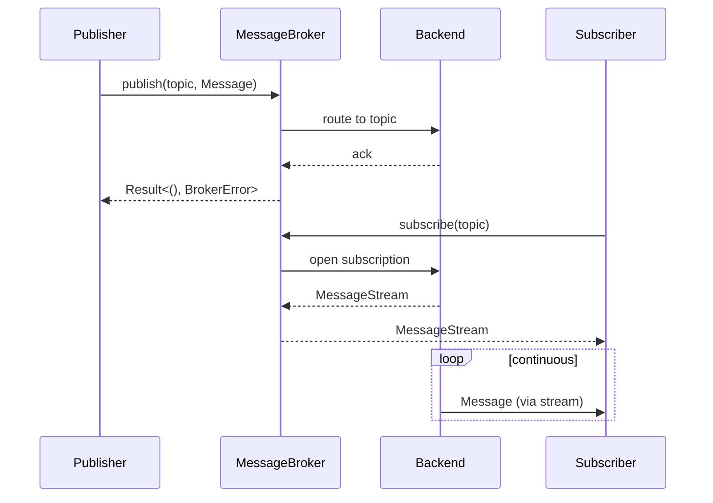
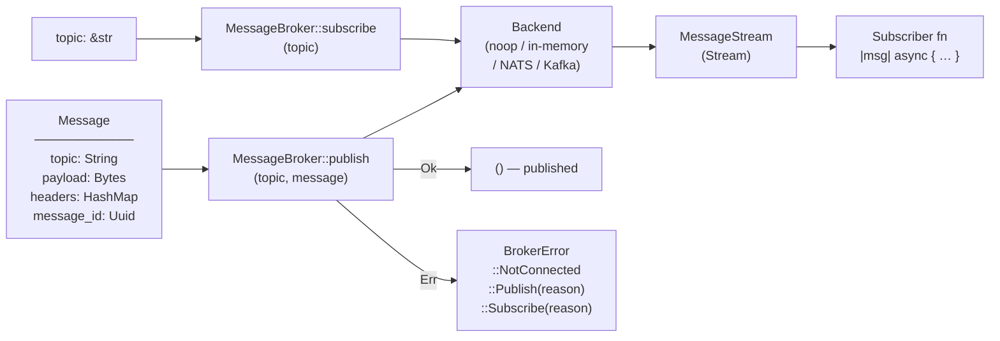

# Architecture — edge-message-broker

Contract crate — defines `MessageBroker` trait, `Message` value type, and `BrokerSvc::noop_broker`. Real backends (in-memory, NATS, Kafka) live in `swe-edge-runtime-message-broker`.

---

## Sequence

> A publisher sends a `Message` to a topic; a subscriber receives it via a `MessageStream`; the broker contract is backend-agnostic.

## Data Flow

> A `Message` enters via `publish`; `subscribe` produces a `MessageStream` of matching messages routed by topic.

